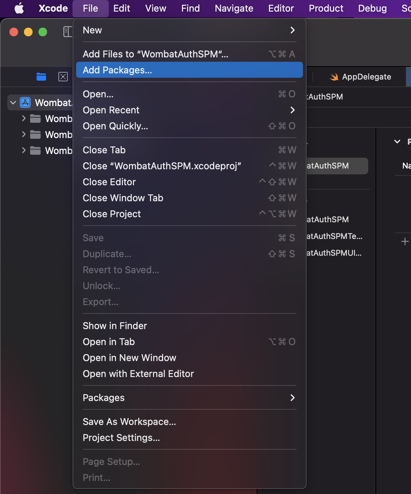
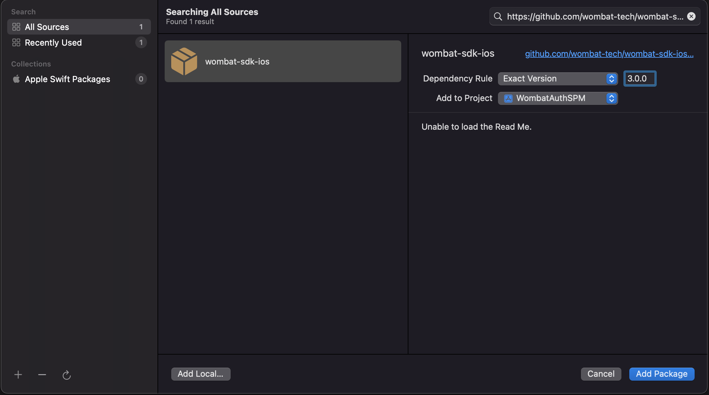

<p align="center">
    
</p>


[](https://developer.apple.com/swift/)
[](https://developer.apple.com/documentation/objectivec)

# WombatAuth

iOS client SDK for DApps.

## Supported Actions

### EVM
1. [**Authorize**](#authorize): Request the public address
2. [**Personal Sign**](#evm-personal-sign): Request a signature of the message with the `personal_sign` method
3. [**Sign Typed Data**](#evm-sign-typed-data): Request a signature of the typped data with the `eth_signTypedData_v4` method
4. [**Transaction**](#evm-transaction): Request a transaction

### EOSIO
1. [**Authorize**](#authorize): Request the account details
2. [**Transfer**](#eosio-transfer): Request a transfer of funds
3. [**Push**](#eosio-push): Request a transaction
4. [**Sign**](#eosio-sign): Request a signature

## Installation

### Swift Package Manager

`WombatAuth` sdk version 3+ supports installation via [Swift Package Manager](https://www.swift.org/package-manager/).

In Xcode go to `File -> Swift Packages -> Add Package Dependency`



Enter the Wombat iOS SDK GitHub repository - `https://github.com/wombat-tech/wombat-sdk-ios`



Select the WombatAuth library


and you are ready to start using WombatAuth library.

### Cocoapods

Add the following line to your Podfile and run `pod install`.

```ruby
pod 'WombatAuth'
```

### Manual
1. Download the latest version of the framework [here](https://github.com/wombat-tech/wombat-sdk-ios/releases).
2. Add `WombatAuth.xcframework` into your Embedded Binaries.

## Setup

Add the following 2 snippets into your `Info.plist`.

```xml
<key>CFBundleURLTypes</key>
<array>
    <dict>
        <key>CFBundleTypeRole</key>
        <string>Editor</string>
        <key>CFBundleURLSchemes</key>
        <array>
            <!-- URL scheme to use when returning from Wombat to your app -->
            <string>wombat.$(PRODUCT_BUNDLE_IDENTIFIER)</string>
        </array>
    </dict>
</array>
```

```xml
<key>LSApplicationQueriesSchemes</key>
<array>
    <!-- URL scheme to use when launching Wombat from your app -->
    <string>wombat</string>
</array>
```

###### If your project is written in Objective-C
4. In project's **Build Settings** set **Always Embed Swift Standard Libraries** to **YES**.
5. Import the library by adding `#import <WombatAuth/WombatAuth-Swift.h>`.

## Usage

#### Register your app

Make sure your app is registered prior to executing any requests.

```swift
import WombatAuth

class AppDelegate: UIResponder, UIApplicationDelegate {
    func application(_ application: UIApplication, didFinishLaunchingWithOptions launchOptions: [UIApplication.LaunchOptionsKey: Any]?) -> Bool {
        WMAuth.shared.registerApp(
            name: "Wombat SDK Sample",
            icon: URL(string: "https://myapp.com/icon")!,
            blockchain: .polygon
        )
        return true
    }
}
```

```objc
#import <WombatAuth/WombatAuth-Swift.h>

[WMAuth.shared registerAppWithName: @"Wombat SDK Sample"
                                  icon: [NSURL URLWithString:@"https://assets.website-files.com/5cde8c951beecf3604688a58/5d120b2cba030f78d70c7236_Wombat_logo_transparent-p-500.png"]
                            blockchain: WMBlockchain.wax];
```

Currently supported blockchains are

- Ethereum
- Polygon
- BNB
- HECO
- Fantom
- Avalanche
- EOS
- TELOS
- WAX

#### Response handler

In order to receive results you need to register an url handler in the `AppDelegate:application(_:open:options:)`.

```swift
return WMAuth.shared.application(open: url) { result in
    switch result {
    case let .success(action, blockchain, data):
        switch action {
        case .authorize:
            let message: String
            if blockchain.isEvm {
                let address = data["address"] as! String
                message = "Public address is \(address)"
            } else {
                let accountName = data["accountName"] as! String
                let publicKey = data["publicKey"] as! String
                message = "Name: \(accountName)\nKey: \(publicKey)"
            }
            showAlert(title: "Auth", message: message)
        case .personalSignEVM:
            let signedMessage = data["signedMessage"] as! String
            showAlert(title: "Personal Sign", message: signedMessage)
        case .signTypedDataEVM:
            let signedMessage = data["signedMessage"] as! String
            showAlert(title: "Signed Typed Data", message: signedMessage)
        case .transactionEVM:
            let transactionId = data["transactionID"] as! String
            showAlert(title: "Transaction", message: transactionId)
        case .signEOSIO:
            let signedMessage = data["signature"] as! String
            showAlert(title: "Sign", message: signedMessage)
        case .transferEOSIO:
            let transactionId = data["transactionID"] as! String
            showAlert(title: "Transaction", message: transactionId)
        case .transactionEOSIO:
            let transactionId = data["transactionID"] as! String
            showAlert(title: "Transaction", message: transactionId)
        default:
            break
        }
    case let .error(action, blockchain, error):
        showAlert(title: "Error", message: error.localizedDescription)
    case let .userCancelled(action, blockchain):
        showAlert(title: "User cancelled")
    default:
        break
    }
}

```

##### Objective-C
```objc
return [WMAuth.shared openURL:url completionHandler:^(WMResultObj *result) {
    switch (result.type) {
        case WMResultTypeSuccess:
            switch (result.action) {
                case WMActionTypeAuthorize: {
                    if (result.blockchain.isEvm) {
                        NSString *address = [result.data valueForKey:@"address"];
                        [self showAlertWithTitle:@"Auth" message:address];
                    } else {
                        NSString *accountName = [result.data valueForKey:@"accountName"];
                        NSString *publicKey = [result.data valueForKey:@"publicKey"];
                        NSString *alertMessage = [NSString stringWithFormat:@"Name: %@\nKey: %@", accountName, publicKey];
                        [self showAlertWithTitle:@"Auth" message:alertMessage];
                    }
                    break;
                }
                case WMActionTypePushTransactionEVM: {
                    NSString *transactionID = [result.data valueForKey:@"transactionID"];
                    [self showAlertWithTitle:@"Push" message:transactionID];
                    break;
                }
                case WMActionTypePersonalSignEVM: {
                    NSString *transactionID = [result.data valueForKey:@"signedMessage"];
                    [self showAlertWithTitle:@"Personal Sign" message:transactionID];
                    break;
                }
                case WMActionTypeSignTypedDataEVM: {
                    NSString *transactionID = [result.data valueForKey:@"signedMessage"];
                    [self showAlertWithTitle:@"Sign Typed Data" message:transactionID];
                    break;
                }
                case WMActionTypePushTransactionEOSIO: {
                    NSString *transactionID = [result.data valueForKey:@"transactionID"];
                    [self showAlertWithTitle:@"Push" message:transactionID];
                    break;
                }
                case WMActionTypeSignEOSIO: {
                    NSString *signature = [result.data valueForKey:@"signature"];
                    [self showAlertWithTitle:@"Sign" message:signature];
                    break;
                }
                case WMActionTypeTransferEOSIO: {
                    NSString *transactionID = [result.data valueForKey:@"transactionID"];
                    [self showAlertWithTitle:@"Transfer" message:transactionID];
                    break;
                };
                case WMActionTypeUnknown: {
                    [self showAlertWithTitle:@"Unknown" message:result.message];
                    break;
                };
            }
            break;
        case WMResultTypeError:
            [self showAlertWithTitle:@"WMResultTypeError" message: result.message];
            break;
        case WMResultTypeUserCancelled:
            [self showAlertWithTitle:@"WMResultTypeUserCancelled" message:@"Cancelled by the user"];
            break;
    }
}];
}
```

## Actions

#### Authorize

```swift
try? WombatAuth.shared.requestAuthorization()
```

```objc
NSError *err;
[WMAuth.shared requestAuthorizationAndReturnError:&err];
```

#### EVM Personal Sign

```swift
try? WMAuth.shared.personalSign(message: "Hello World!")
```

```objc
try? 
```

#### EVM Sign Typed Data

```swift
let data = """
    {
        "types": {
            "EIP712Domain": [
                {"name": "name", "type": "string"},
                {"name": "version", "type": "string"},
                {"name": "chainId", "type": "uint256"},
                {"name": "verifyingContract", "type": "address"}
            ],
            "Person": [
                {"name": "name", "type": "string"},
                {"name": "wallet", "type": "bytes32"},
                {"name": "age", "type": "int256"},
                {"name": "paid", "type": "bool"}
            ]
        },
        "primaryType": "Person",
        "domain": {
            "name": "Person",
            "version": "1",
            "chainId": 1,
            "verifyingContract": "0xCcCCccccCCCCcCCCCCCcCcCccCcCCCcCcccccccC"
        },
        "message": {
            "name": "alice",
            "wallet": "0xbBbBBBBbbBBBbbbBbbBbbbbBBbBbbbbBbBbbBBbB",
            "age": 40,
            "paid": true
        }
    }
""".data(using: .utf8)!
try? WMAuth.shared.signTypedData(data: data)
```

#### EVM Transaction

##### Transfer of the blockchains native currency e.g. MATIC on polygon
```swift
let value = String(format:"%llx", 100_000_000_000_000_000)
let sender = "0xc60Fa6D34C8A926E22791D7178F883Bd4cf2B312"
let receiver = "0x7F4Ff6c65fB4a1211931b80d05062daDfB5480bD"
try? WMAuth.shared.pushTransaction(
    WMEVMTransaction(
        from: sender,
        to: receiver,
        value: value,
        data: nil
    )
)
```

```objc
NSError *err;
NSString *value = [NSString stringWithFormat: @"%lx", 100000000000000000];
NSString *sender = @"0xc60Fa6D34C8A926E22791D7178F883Bd4cf2B312";
NSString *receiver = @"0x7F4Ff6c65fB4a1211931b80d05062daDfB5480bD";
[WMAuth.shared pushEVMTransaction:[[WMEVMTransaction alloc] initFrom:sender
                                                                    to:receiver
                                                                value:value
                                                                data:nil]
                                    :&err];
```

##### Invocation of smart contract on the registered blockchain.
```swift
let sender = "0xc60Fa6D34C8A926E22791D7178F883Bd4cf2B312"
let contract = "0x2d7882beDcbfDDce29Ba99965dd3cdF7fcB10A1e"
let data = "a9059cbb0000000000000000000000007f4ff6c65fb4a1211931b80d05062dadfb5480bd000000000000000000000000000000000000000000000000016345785d8a0000".hexadecimal
try? WMAuth.shared.pushTransaction(
    WMEVMTransaction(
        from: sender,
        to: contract,
        value: nil,
        data: data
    )
)
```

```objc
NSString *sender = @"0xc60Fa6D34C8A926E22791D7178F883Bd4cf2B312";
NSString *contract = @"0x2d7882beDcbfDDce29Ba99965dd3cdF7fcB10A1e";
NSData *data = [@"a9059cbb0000000000000000000000007f4ff6c65fb4a1211931b80d05062dadfb5480bd000000000000000000000000000000000000000000000000016345785d8a0000" stringToHexData];
NSError *err;
[WMAuth.shared pushEVMTransaction:[[WMEVMTransaction alloc] initFrom:sender
                                                                    to:contract
                                                                value:nil
                                                                data:data]
                                    :&err];
```

#### EOSIO Transfer
```swift
let from = "{FROM_ACCOUNT_NAME}"
let to = "{TO_ACCOUNT_NAME}"
let transfer = WMTransfer(
    from: from,
    to: to,
    amount: 1,
    precision: 4,
    contract: "eosio.token",
    symbol: "EOS",
    memo: "Some memo"
)
WombatAuth.shared.requestTransfer(transfer)
```

```objc
NSString *sender = @"{SENDER_ACCOUNT_NAME}";
NSString *receiver = @"{RECEIVER_ACCOUNT_NAME}";
WMEOSIOTransfer *transfer = [[WMEOSIOTransfer alloc] initFrom: sender
                                                            to: receiver
                                                        amount: 1
                                                    precision: 4
                                                        contract: @"eosio.token"
                                                        symbol: @"EOS"
                                                            memo: @"Some memo"];
NSError *err;
[WMAuth.shared requestEOSIOTransfer:transfer :&err];
```

#### EOSIO Push
```swift
let transaction = WMTransaction(
    from: "account_name",
    actions: [
        .init(
            account: "eosio.token",
            name: "transfer",
            auth: [.init(actor: "account_name", permission: "owner")],
            data: [
                "from": "account_name",
                "to": "account_name_2",
                "quantity": "1.0000 EOS",
                "memo": "Here you go"
            ]
        )
    ]
)

WombatAuth.shared.pushTransaction(transaction)
```

```objc
NSString *sender = @"{SENDER_ACCOUNT_NAME}";
NSString *receiver = @"{RECEIVER_ACCOUNT_NAME}";
WMEOSIOAuth *auth = [[WMEOSIOAuth alloc] initWithActor: sender permission: @"active"];
NSArray<WMEOSIOAction *> *actions = @[[[WMEOSIOAction alloc] initWithAccount: @"eosio.token" name: @"transfer" auth: @[auth] data: @{
    @"from": sender,
    @"to": receiver,
    @"quantity": @"1 EOS",
    @"memo": @"Here you go"
}]];
WMEOSIOTransaction *transaction = [[WMEOSIOTransaction alloc] initFrom: @"aaaabbbbcccc" actions: actions];
NSError *err;
[WMAuth.shared pushEOSIOTransaction:transaction :&err];
```

#### EOSIO Sign
```swift
WombatAuth.shared.requestSignature(account: "account_name", data: "Some data")
```

```objc
NSError *err;
    [WMAuth.shared requestSignatureWithAccount: @"account" data:@"Hello World!" error: &err];
```
